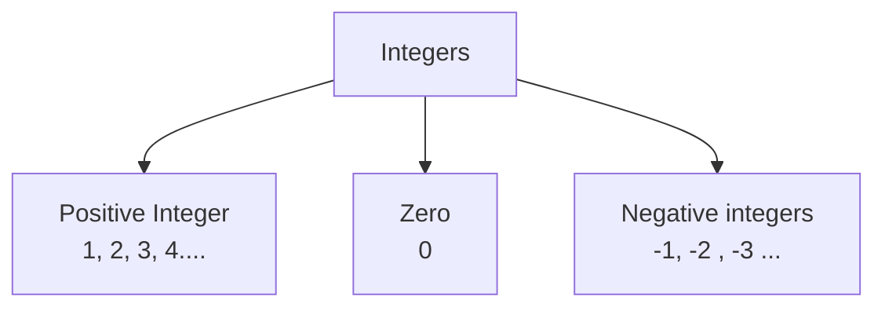

## Number System

<h3> Natural Numbers </h3>
All counting numbers are called natural numbers which are denoted by N.

Example: N ={1, 2 , 3 , 4 , 5..... $\infty$}

<h3> Whole Numbers</h3>
All counting numbers together with zero are called whole numbers. They are denoted by W.

Example: W ={0, 1, 2 , 3 , 4 , 5..... $\infty$}

<h3> Integers</h3>

The numbers 0 , 1 , -1 , 2 , -2 , 3 -3 .. are called integers.

Note: Zero is called called zero integer.

<h3> Prime Numbers</h3>
A natural number other than 1, which has no other factor exept 1 and itself, is called prime number.

Example: 2, 3, 5, 7, 11 etc

Note: 2 is the only Prime which is even. All other prime number is odd. 2 is the smallest prime number.

<h3>Co-Prime Numbers</h3>

The two natural numbers whose H.C.F = 1 are called co-prime numbers.  
Examples: {7,9}, {7,11} etc
 

